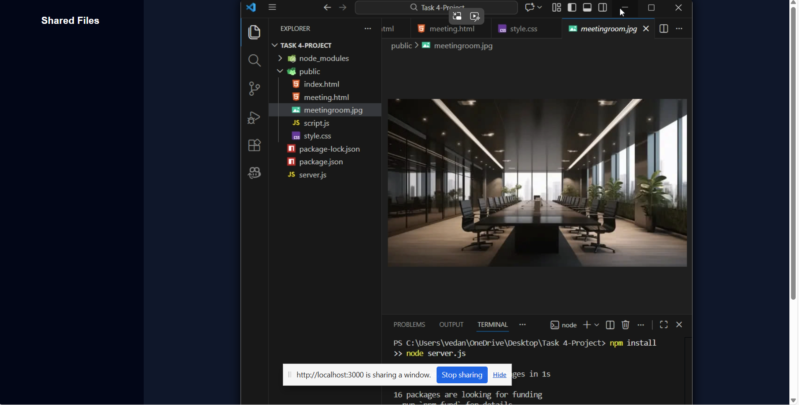

# TASK 4 – Real-Time Communication App | Internship Project

A real-time video conferencing and collaboration web application built using WebRTC, Socket.io, Express.js, and vanilla JavaScript.

## Features
- Multi-user video calling
- Screen sharing
- File sharing
- Whiteboard collaboration
- Real-time communication
- Secure media transmission (WebRTC)

## Tech Stack
HTML, CSS, JavaScript, Node.js, Express.js, Socket.io, WebRTC

#Screenshot



## Run Project
```bash
npm install
npm start
